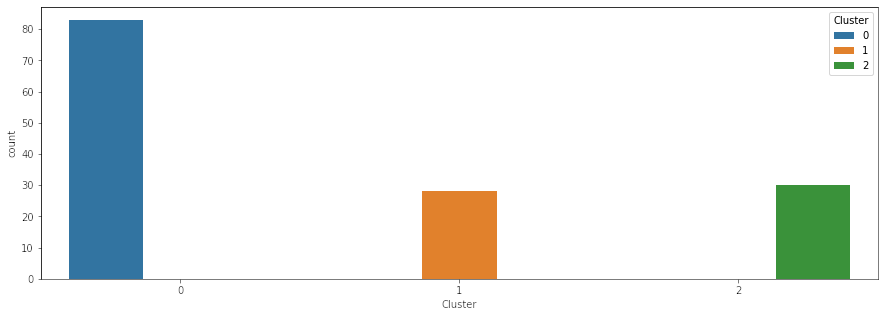
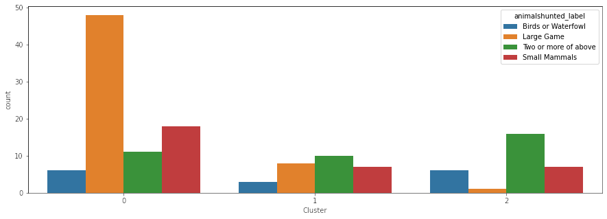
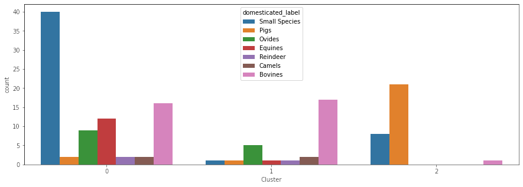
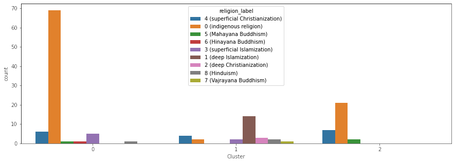
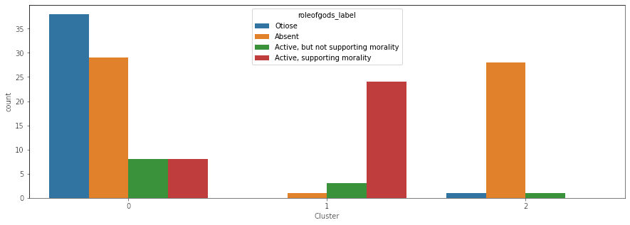

One of the most fascinating parts of data science to me is machine learning. Before I started my anthropology class, the only context I heard about machine learning in is Apple and Google using it to improve user experience on their devices. I had no idea about the wide world of machine learning. Now, I'm using machine learning to model and understand the anthropological data I collected from D-Place.

<!--more-->

Today, I'm going to focus on unsupervised learning and clustering using the KModes algorithm. This is not a tutorial, but rather just a run through the results of my clustering code. First, I'd like to start off with a map of my clusters:

<iframe style="width:100%;height:750px;border:none;" src="../projects/cluster_map/cluster_map" title="Map of the locations of data clusters."></iframe>

Map Permalink: [https://brandonsvoid.com/projects/cluster_map/cluster_map](../projects/cluster_map/cluster_map)

This map shows a couple of trends (keep in mind that these are all going to have exceptions, such is the nature of clustering). The first big trend I noticed was how Cluster 3 (Red) is primarily in Oceania. Meanwhile Cluster 1 (Black) is all over the place, and Cluster 2 (Green) is primarily in the Old World. This helped me to understand the relationship between the clusters better than almost anything else. It also confirmed to me that the clustering of the data was *mostly* sensible.

Next we have a bunch of charts:

Every chart shows a category and the number of societies in that category per cluster (except, of course, for the). Each chart (except for the one just showing the clusters, of course) elucidates some correlations. The correlation most interesting to me is the one between pigs and societies with absent or otiose gods. The whole idea behind this project was trying to see where food taboos come from, and in two religions (Judaism and Islam), there are taboos against the pig. Now of course, correlation doesn't equal causation and more research is needed, but when I first performed this clustering, I was super excited about the results (even though there's a million other correlative factors to consider, including the role of indigenous religions and geography). While I can think of a million different reasons for why the clusters are the way that they are, this was an amazing first step. It indicated to me there may be something more here.

The next step I took was modelling the correlation between all of these different variables, and that is something I will cover in my next blog post. I hope y'all are enjoying this series, and I can't wait for the ending to this adventure (if an ending ever comes, of course).

Link to GitHub repo: <https://github.com/brandonrford/cluster_map>

Header Image:

* [The header image for this article](https://pixabay.com/photos/maps-pages-papers-vintage-1854199/) was created by Pixabay user [Pexels](https://pixabay.com/users/pexels-2286921/) and is licensed under the [Pixabay license](https://pixabay.com/service/license/).

Data Sources:

* All categorical data is from [D-Place](https://d-place.org), specific citations are below.
* All location data is from [Glottolog](https://glottolog.org), specific citation is below.

Data Citations:

> [Murdock, G. P., & Morrow, D. O. (1970). Subsistence economy and supportive practices: Cross-cultural codes 1. Ethnology, 9(3), 302-330](https://d-place.org/parameters/SCCS6#2/14.3/151.2)
>
> [Murdock, G. P., & Morrow, D. O. (1970). Subsistence economy and supportive practices: Cross-cultural codes 1. Ethnology, 9(3), 302-330](https://d-place.org/parameters/SCCS10#2/14.3/151.2)
>
> [Murdock (1962-1971); Gray (1999)](https://d-place.org/parameters/SCCS238#2/14.3/150.1)
>
> [Rosenblatt, P. C., Walsh, R. P., & Jackson, D. A. (2011). Grief and mourning codes. World Cultures eJournal, 18(2)](https://d-place.org/parameters/SCCS2002#2/14.3/151.2)

Glottolog Citation:

> Hammarström, Harald & Forkel, Robert & Haspelmath, Martin & Bank, Sebastian. 2021.
>
> Glottolog 4.4.
>
> Leipzig: Max Planck Institute for Evolutionary Anthropology.
>
> <https://doi.org/10.5281/zenodo.4761960>
>
> (Available online at <http://glottolog.org>, Accessed on 2021-10-24.)

Python Packages Used:

Folium (map tool)

> [Folium](https://python-visualization.github.io/folium/)
>
> Licensed under an MIT License, copyright [Rob Story](https://github.com/wrobstory)

Branca (legend tool)

> [Branca](https://github.com/python-visualization/branca)
>
> Licensed under an MIT License, copyright [Martin Journois](https://github.com/BibMartin)

Pandas (dataset wrangler)

> [Pandas](https://pandas.pydata.org)
>
> The pandas development team. *pandas-dev/pandas: Pandas*. Latest, Zenodo, Oct. 2021. 10.5281/zenodo.3509134. <https://doi.org/10.5281/zenodo.3509134>.
>
> [Data structures for statistical computing in python](https://conference.scipy.org/proceedings/scipy2010/pdfs/mckinney.pdf), McKinney, Proceedings of the 9th Python in Science Conference, Volume 445, 2010.

Seaborn (data visualization)

> [Seaborn](https://seaborn.pydata.org/index.html)
>
>Waskom, Michael L. "seaborn: statistical data visualization." *Journal of Open Source Software*, vol. 6, no. 60, The Open Journal, 2021, <https://doi.org/10.21105/joss.03021>.

Matplotlib (data visualization)

> [Matplotlib](https://matplotlib.org/stable/index.html)
>
>Hunter, J. D. "Matplotlib: A 2D graphics environment." *Computing in Science \& Engineering*, vol. 9, no. 3, IEEE COMP SOC, 2007, <https://doi.org/10.5281/zenodo.5194481>.

KModes (clustering algorithm)

> [KModes](https://github.com/nicodv/kmodes)
>
> Licensed under an MIT License, copyright [Nico de Vos](https://github.com/nicodv).
